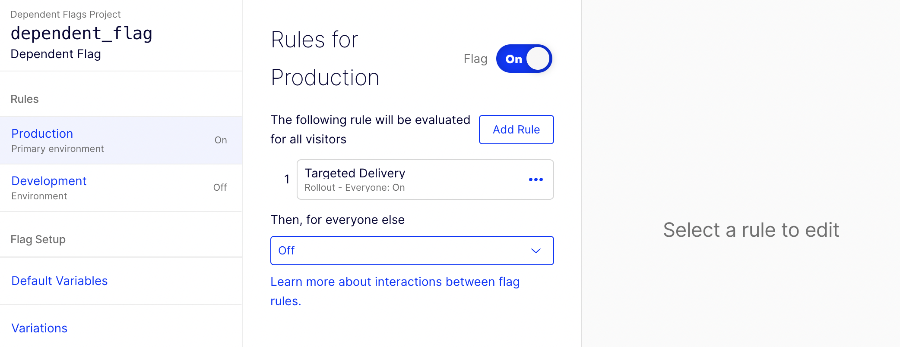
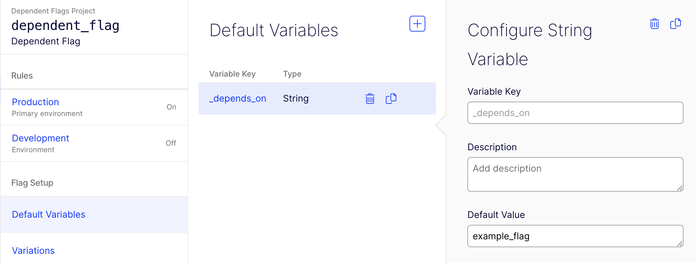

# flag-dependencies-demo

A [demonstration](https://optimizely.github.io/flag-dependencies-demo/) of a simple implementation of "flag dependencies" with Optimizely Full Stack. 

For a quick walkthrough of this demo, check out this [video overview](https://www.loom.com/share/bee221cd914341a1ad86b062de991d4b).

## Try it out

Check out the [interactive demo](https://optimizely.github.io/flag-dependencies-demo/).

The demo source code is in the [docs](/docs) directory in this repository. The flag dependency evaluation logic lives in [flag_dependencies.js](/docs/js/flag_dependencies.js). 

## Usage

```js
// Optimizely SDK
import "https://unpkg.com/@optimizely/optimizely-sdk@4.9.1/dist/optimizely.browser.umd.min.js";

// Flag Dependency module
import * as deps from "./flag_dependencies.js";

// Instantiate an Optimizely client
let optimizelyClient = optimizelySdk.createInstance({
  sdkKey : "LbmzK7viE2J2bP5ozmZR9"
});

// Create a context object for user123
let user = optimizelyClient.createUserContext("user123");

// Decide my_flag without evaluating dependencies
let decision_without_dependencies = user.decide("my_flag");

// Evaluate my_flag's dependencies statelessly and decide my_flag according to its rules if 
// they are satisfied. Return the default variation if not.
let decision_with_dependencies = deps.decide()

```

## Specifying dependencies

In the following example, `dependent_flag` uses a [targeted rollout rule](https://docs.developers.optimizely.com/experimentation/v4.0.0-full-stack/docs/run-flag-deliveries) and would normally evaluate to **on** for everyone. 

<p align="center"></p>

However, we've added a special `_depends_on` [flag variable](https://docs.developers.optimizely.com/experimentation/v4.0.0-full-stack/docs/create-flag-variations#prerequisite-create-default-variables) to specify that `dependent_flag` depends on `example_flag`.

<p align="center"></p>

Dependencies are specified in `_depends_on`'s [default value](https://docs.developers.optimizely.com/experimentation/v4.0.0-full-stack/docs/create-flag-variations#prerequisite-create-default-variables) as a comma-separated list of dependencies that each take one of the following forms:

```js
  "flagKey"              // This flag depends on flagKey being enabled
  "flagKey:variationKey" // This flag depends on flagKey's variationKey variation
```

When a the `decide()` function exported by [flag_dependencies.js](https://github.com/optimizely/flag-dependencies-demo/blob/master/docs/js/flag_dependencies.js) is used to make a decision for `dependent_flag` (see [Usage](#usage)), its dependencies are evaluated first.

If all dependencies are satisifed, the decision returned will follow the flag's [delivery and experiment rules](https://docs.developers.optimizely.com/full-stack/v4.0/docs/create-flag-variations#use-flag-variations), as normal.

If one or more dependencies are not satisfied, the **default variation**, specified by the "everyone else" rule in the flag's configuration, is returned.


## Disclaimer and Acknowledgements

This demo is meant to be used as inspiration for your own implementation of flag dependencies. It has not been tested extensively and **should not be run in any serious production environment**. If you find a bug, please [file an issue](https://github.com/optimizely/flag-dependencies-demo/issues) or (even better) [create a pull request](https://github.com/optimizely/flag-dependencies-demo/pulls).

Built with gratitude using [Skeleton](http://getskeleton.com/), [Alpine.js](https://alpinejs.dev/), and [leader-line](https://anseki.github.io/leader-line/).

